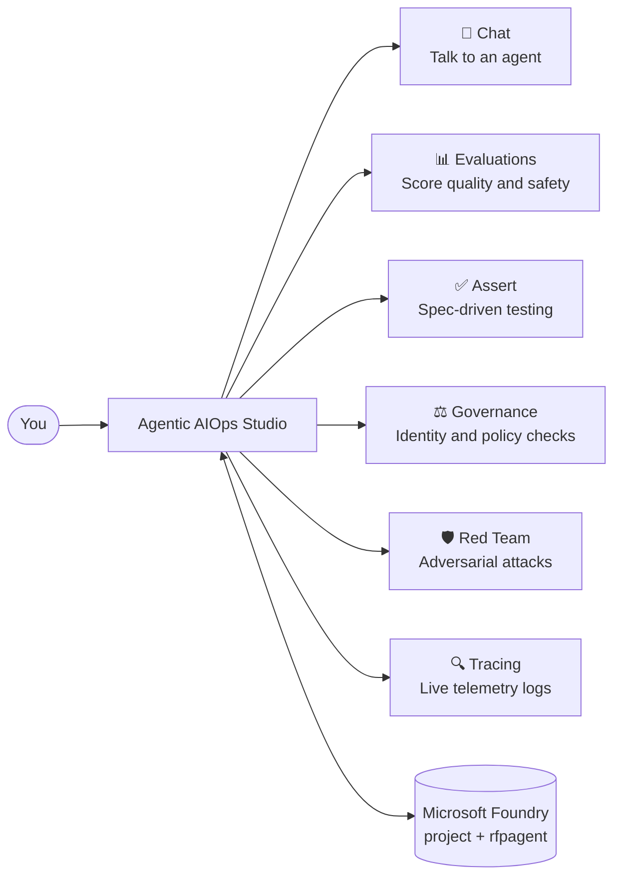

# Agentic AIOps Studio — Documentation

Welcome! This folder is the complete guide to the **Agentic AIOps Studio**, a
Streamlit application for operating, testing, evaluating, and governing AI agents
hosted in **Microsoft Foundry**.

If you have never seen this repository before, start at the top of this list and
work down. Each document is written in plain English and assumes no prior
knowledge of the codebase.

## 📚 The documents

| Document | What it covers | Read it when… |
|----------|----------------|---------------|
| **[getting-started.md](getting-started.md)** | Install, configure, sign in, and run the app for the first time. | You want to get the app running on your machine. |
| **[tutorials.md](tutorials.md)** | A guided, click-by-click tour of all six tabs (Chat, Evaluations, Assert, Governance, Red Team, Tracing). | You have the app running and want to learn what each feature does. |
| **[architecture.md](architecture.md)** | How the app is built and how data flows — with diagrams and flowcharts. | You want to understand or modify the code. |
| **[skills.md](skills.md)** | The **mandatory lifecycle standard** — the skills, frameworks, and release gates every agent must pass. | You are building, testing, shipping, or reviewing an agent here. |
| **[business-value.md](business-value.md)** | The business problem, the use cases, and the value/ROI story. | You are explaining *why* this matters to a stakeholder or leader. |

## 🧭 What is this app, in one paragraph?

Modern companies are deploying **AI agents** — software that uses large language
models (LLMs) to do real work, like answering RFP (Request for Proposal)
questions. But once an agent is live, teams need to keep asking hard questions:
*Is it accurate? Is it safe? Can it be tricked? Is it behaving today the way it
did last week?* Agentic AIOps Studio is a single, business-professional dashboard
that answers those questions. It discovers the agents in your Foundry project,
lets you **chat** with them, **evaluate** their quality, **stress-test** their
behaviour (Assert), check their **governance** posture, **red-team** them for
safety, and inspect their live **traces** — all from one screen, all secured with
your own Azure identity.

## 🗺️ The six tabs at a glance

## 🔐 One golden rule: identity-only authentication

This app **only** uses `DefaultAzureCredential` — your own Azure sign-in (via
`az login`) or a managed identity when hosted. There are **no API keys** and **no
service-principal secrets** anywhere in the code or configuration. This keeps
secrets out of the repo and makes every action traceable to a real user.

## 🧩 Technology building blocks

- **[Streamlit](https://streamlit.io/)** — the web UI framework.
- **Azure AI Projects SDK** — discovers the agents in your Foundry project.
- **Microsoft Agent Framework** — runs (orchestrates) the agents.
- **Azure AI Evaluation SDK** — quality, safety, and red-team scoring.
- **ASSERT (`assert_ai`)** — turns a plain-English behaviour spec into tests.
- **Agent Governance Toolkit** — identity, prompt-defense, and policy checks.
- **Application Insights** — stores the OpenTelemetry traces the Tracing tab reads.

➡️ **Next:** open **[getting-started.md](getting-started.md)**.
