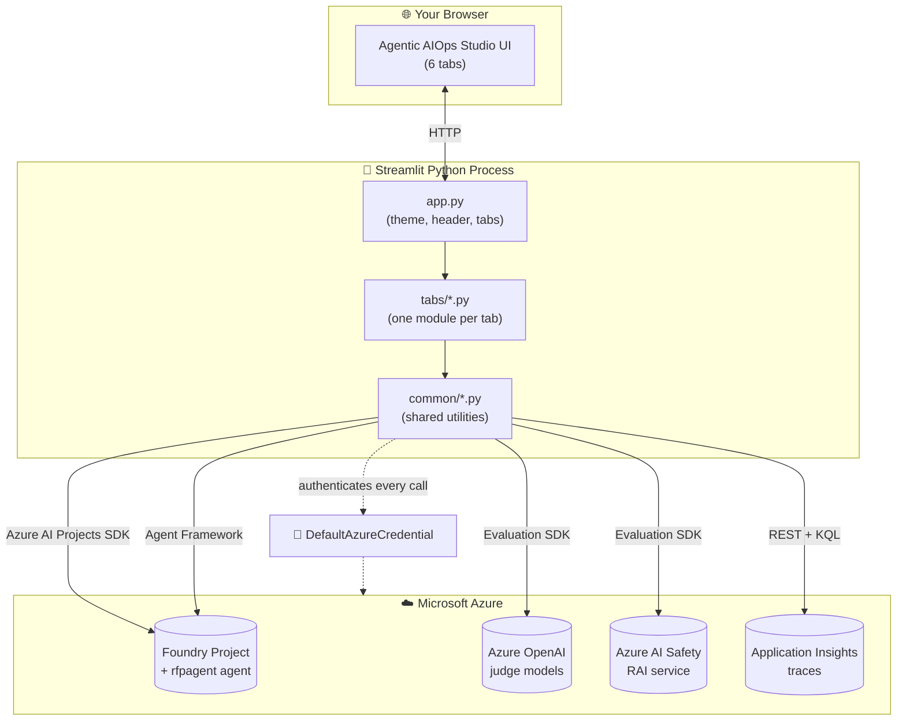
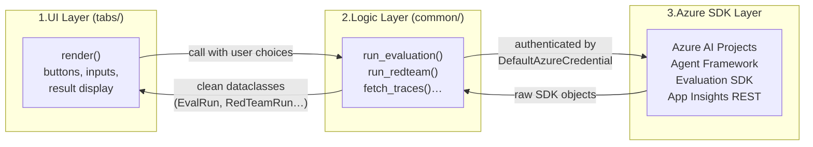
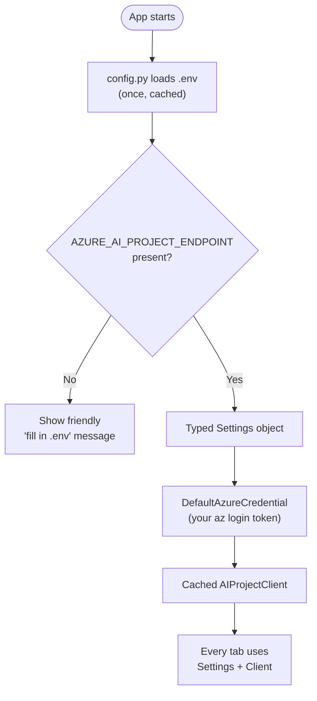
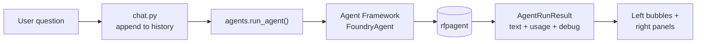
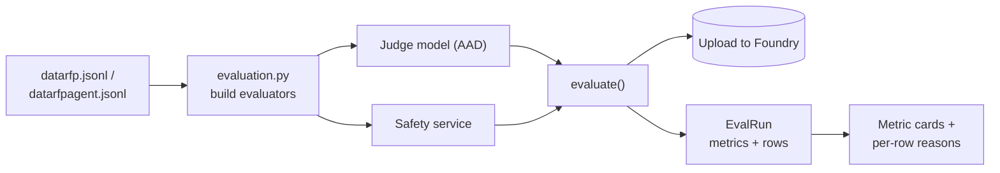
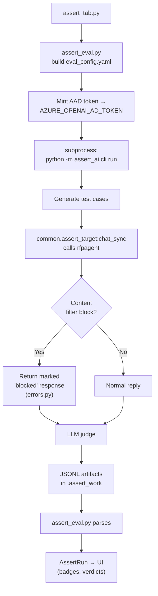
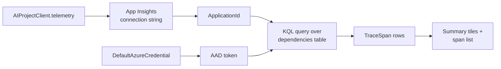
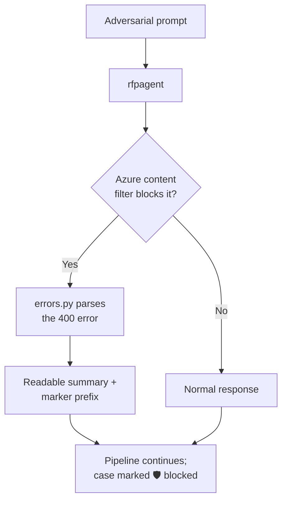

# Architecture

This document explains **how Agentic AIOps Studio is built** and **how data flows
through it**, in plain English and with diagrams. No deep Python knowledge is
required — if you can read a flowchart, you can follow along.

---

## 1. The big picture

The app is a **Streamlit** web application. Streamlit runs your Python file
(`app.py`) top-to-bottom every time the user interacts, and turns the Python calls
into a web page. There is **no separate backend server** — the same Python process
both renders the UI and calls Azure.



**Key takeaway:** the UI layer (`tabs/`) is thin. All the real work — talking to
Azure, running evaluations, parsing results — lives in reusable modules under
`common/`. Tabs just render what `common/` returns.

---

## 2. Folder and file layout

```
app.py                  # Entry point: sets theme, header, and the 6 tabs
common/                 # Reusable logic shared across tabs
  config.py             # Reads + validates .env, exposes typed Settings
  azure_clients.py      # Cached AIProjectClient + DefaultAzureCredential
  agents.py             # Discover agents + run an agent (Agent Framework)
  chat.py               # Conversation state (Streamlit session_state)
  evaluation.py         # Azure AI Evaluation: model + agent metrics
  assert_eval.py        # ASSERT pipeline orchestration (subprocess)
  assert_target.py      # The callable ASSERT drives against the agent
  governance.py         # Agent Governance Toolkit checks
  redteam.py            # Red Team (PyRIT) scan + Foundry upload
  tracing.py            # Reads OpenTelemetry spans from App Insights
  errors.py             # Reusable content-filter error parsing/formatting
  styles.py             # Material 3 theme / CSS
  ui.py                 # Shared UI components (header, chips, panels)
tabs/                   # One module per tab; each exposes render()
  chat_tab.py  evaluations_tab.py  assert_tab.py
  governance_tab.py  redteam_tab.py  tracing_tab.py
evaldata/               # Evaluation datasets (datarfp.jsonl, datarfpagent.jsonl)
.env / .env.example     # Configuration (DefaultAzureCredential only)
docs/                   # ← you are here
```

### The "common place" principle

A core design rule from day one: **shared functions and utilities live in one
place** (`common/`) so they can be reused across tabs. Examples:

- `config.py` is the **only** module that reads environment variables. Everything
  else asks it for typed `Settings`.
- `agents.py` is the **only** place that discovers or runs agents.
- `errors.py` is the **only** place that interprets Azure content-filter errors —
  reused by Assert, Governance, and Red Team.

---

## 3. How a request flows: the layers

Every tab follows the same three-layer pattern. This keeps the UI simple and the
logic testable.



Notice the logic layer always returns a **structured dataclass** (e.g. `EvalRun`,
`RedTeamRun`, `TraceQuery`, `AssertRun`, `GovernanceReport`). The UI never sees raw
SDK objects — it just reads clean fields. This is why errors never crash the app:
failures are captured into an `error` field on the dataclass and rendered as a
friendly message.

---

## 4. Configuration and authentication flow

Configuration is loaded once and cached. Authentication uses your Azure identity
for **every** call — no secrets anywhere.



- **`get_settings()`** (in `config.py`) parses `.env` once per session and derives
  smart defaults — e.g. it figures out the Azure OpenAI endpoint from the project
  endpoint, and auto-detects whether the judge model is a "reasoning" model.
- **`get_credential()`** and **`get_project_client()`** (in `azure_clients.py`) are
  cached as Streamlit resources, so the app signs in and builds the client once,
  not on every interaction.

---

## 5. Tab-by-tab data flow

### 💬 Chat
`chat_tab.py` → `agents.list_foundry_agents()` (discover) and
`agents.run_agent()` (execute via Agent Framework). Conversation is kept in
`chat.py` using Streamlit `session_state`.



### 📊 Evaluations
`evaluations_tab.py` → `evaluation.run_evaluation()` (text metrics) and
`evaluation.run_agent_evaluation()` (tool-use metrics). Both call the Azure AI
Evaluation SDK's `evaluate()` and **upload results to Foundry** for audit.



### ✅ Assert
This one is special: ASSERT runs as a **subprocess** to isolate its asyncio and
LiteLLM behaviour from Streamlit.



Why a subprocess? ASSERT monkeypatches the async event loop and the LiteLLM
client. Running it in its own process keeps those changes from affecting the main
Streamlit app, and lets the agent callable use `asyncio.run` freely.

### ⚖️ Governance
`governance_tab.py` → `governance.run_governance()` runs four deterministic checks
(toolkit attestation, declared identity, static prompt-defense on the *live*
system prompt, policy simulation) plus an optional live
`governance.run_resistance_test()`.

### 🛡️ Red Team
`redteam_tab.py` → `redteam.run_redteam()` builds an Azure AI Evaluation `RedTeam`
scan (PyRIT), drives it against a target callable that wraps `run_agent`, and
uploads to Foundry. The target offloads each agent call to a worker thread so a
fresh event loop is used inside the scan's own event loop.

### 🔍 Tracing
`tracing_tab.py` → `tracing.py` gets the connected Application Insights
`ApplicationId` from the project, acquires an AAD token, and runs a **KQL** query
against the App Insights REST API to read OpenTelemetry spans.



---

## 6. Cross-cutting design principles

| Principle | How it shows up in the code |
|-----------|-----------------------------|
| **Identity-only auth** | `DefaultAzureCredential` everywhere; `.env` has no keys; ASSERT exports an AAD token, never an API key. |
| **One source of config** | Only `config.py` reads `os.environ`. |
| **Reusable utilities** | `common/` holds all shared logic; `errors.py` centralizes content-filter handling. |
| **Never crash the UI** | Logic functions catch exceptions into an `error` field on a dataclass; tabs render it as a friendly message. |
| **Auditable by default** | Evaluations and Red Team upload results to Foundry; Tracing reads production telemetry. |
| **Defensive SDK access** | Helpers like `_first_attr` / `_nav` read fields by trying several names, so the app survives SDK version drift. |
| **Bounded runtime** | Red Team is single-turn with few categories; ASSERT/agent calls have hard timeouts. |

---

## 7. Resilience: how errors are handled

A recurring theme is graceful degradation. The clearest example is the
**content-filter** path. When ASSERT or Red Team sends an adversarial prompt and
Azure's safety policy blocks it (HTTP 400, `code: content_filter`), that is the
*agent successfully defending itself* — not a bug.



`common/errors.py` is deliberately defensive: it tries a strict parse
(`ast.literal_eval`) and falls back to a regex if the error text contains awkward
characters (like the apostrophe in "OpenAI's"). It never raises — so the layer
above always gets a clean result.

---

## 8. Where state lives

| State | Stored in | Lifetime |
|-------|-----------|----------|
| Conversation history, selected agent, last result | Streamlit `session_state` (via `chat.py`) | Until the browser tab is closed / cleared. |
| Parsed `.env` settings, Azure client | `@lru_cache` / `@st.cache_resource` | Per app session. |
| Evaluation & Red Team results | Uploaded to the **Foundry project** | Permanent (auditable). |
| ASSERT artifacts | `.assert_work/` on disk | Until cleaned up. |
| Red Team artifacts | `.redteam_work/` on disk | Until cleaned up. |
| Production traces | **Application Insights** | Per its retention policy. |

---

➡️ **Next:** open **[business-value.md](business-value.md)** for the business case,
or revisit **[tutorials.md](tutorials.md)** for the hands-on tour.
