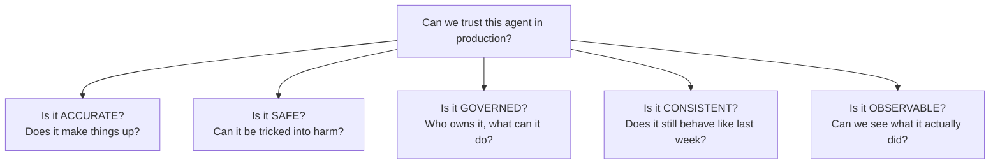
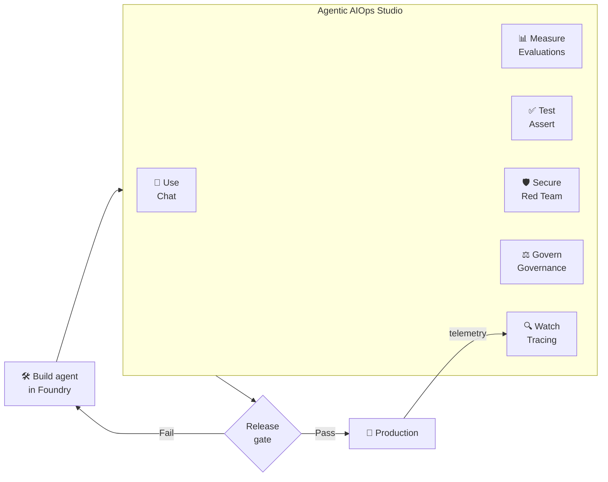
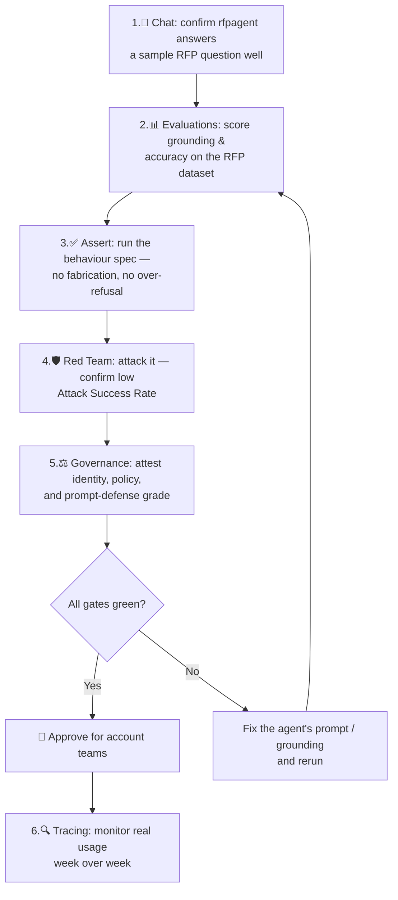

# Business Use Case & Value

This document is for decision-makers and anyone who needs to explain **why**
Agentic AIOps Studio matters. It is written in plain business language — no code.

---

## 1. The business problem

Enterprises are racing to deploy **AI agents** — LLM-powered assistants that do
real work. A common, high-value example is an **RFP agent** (`rfpagent` in this
project): it drafts answers to procurement and Request-for-Proposal questions,
grounded in a company's proposal materials, so sales teams respond faster.

But deploying an agent is the *easy* part. The hard part is **trusting it in
production**, every single day. Leaders consistently ask five questions:

Today these questions are usually answered with scattered scripts, manual spot
checks, and screenshots — slow, inconsistent, and impossible to audit. The result
is **risk**: an agent that fabricates a certification, leaks confidential pricing,
follows a malicious instruction hidden in a pasted document, or silently degrades
after a model update.

---

## 2. The solution

**Agentic AIOps Studio** is a single, business-professional control room for the
**operational lifecycle of an AI agent** — discover, use, evaluate, test, govern,
red-team, and observe — all from one screen, all secured by the user's own
corporate identity.

It brings "AIOps" discipline (the operational rigor we apply to production
software) to AI agents.

| The five questions | The tab that answers it | What it produces |
|--------------------|------------------------|------------------|
| Is it accurate? | **📊 Evaluations** | Quality scores (groundedness, relevance, accuracy) with reasons, stored in Foundry. |
| Is it safe? | **🛡️ Red Team** | An Attack Success Rate from automated adversarial attacks, audited in Foundry. |
| Does it follow the spec? | **✅ Assert** | Pass/fail tests generated from a plain-English behaviour spec. |
| Is it governed? | **⚖️ Governance** | Identity, capability policy, and prompt-defense grades. |
| Is it observable? | **🔍 Tracing** | Live production telemetry — what the agent actually did. |
| Can we use it? | **💬 Chat** | A direct conversation interface for day-to-day use and sanity checks. |

---

## 3. Who benefits (personas)

| Role | What they get | Pain it removes |
|------|---------------|-----------------|
| **Sales / Proposal teams** | A reliable RFP assistant they can trust. | Hours of manual drafting; fear of wrong answers in client documents. |
| **AI / ML engineers** | One place to evaluate and regression-test agents. | Cobbling together throwaway evaluation scripts. |
| **AI safety / Responsible AI teams** | Automated red-teaming and safety scoring. | Manual, unrepeatable adversarial testing. |
| **Risk, Compliance & Security** | Governance attestations and an audit trail in Foundry. | No evidence that an agent was vetted before release. |
| **Engineering leaders** | A dashboard to gate releases and monitor health. | Flying blind on whether an agent is production-ready. |

---

## 4. Where it fits in the agent lifecycle

The Studio sits **between building an agent and trusting it in production**, and
keeps watching after release. Evaluations, Assert, and Red Team become a
**release gate**; Tracing provides **ongoing monitoring**.

---

## 5. The value story

### Quantifiable value

| Lever | Before | With the Studio |
|-------|--------|-----------------|
| **Time to validate a release** | Days of manual testing | Minutes, with one-click reruns. |
| **Test coverage** | A handful of hand-written prompts | Auto-generated test suites + adversarial scans across multiple strategies. |
| **Audit evidence** | Screenshots, tribal knowledge | Every evaluation and red-team run stored centrally in Foundry. |
| **Safety incidents caught pre-release** | Often discovered in production | Surfaced by Red Team / Assert before go-live. |
| **Onboarding a new agent** | Custom scripting per agent | Point the Studio at the Foundry project — agents are auto-discovered. |

### Qualitative value

- **Confidence to ship.** Teams release agents knowing they've been measured,
  attacked, and governed — not on a hope.
- **A shared language.** Engineers, safety teams, and compliance all look at the
  same scores and the same audit trail.
- **Faster iteration.** One-click rerun after every prompt or model change turns
  testing from a chore into a habit.
- **Reduced reputational and legal risk.** Catching a fabricated fact or a
  jailbreak before a customer sees it protects the brand.

---

## 6. Built-in trust & security advantages

These are not afterthoughts — they're designed in:

- **Identity-only access (`DefaultAzureCredential`).** No API keys or
  service-principal secrets exist in the app or its configuration. Every action
  runs as a real, named user, so it's inherently auditable and inherits your
  organization's access controls.
- **Central audit trail.** Evaluation and red-team runs are uploaded to the
  Foundry project, creating durable, reviewable evidence.
- **Safe-by-default red teaming.** Adversarial tests are bounded (single-turn, few
  categories) and a blocked attack is correctly counted as a *win* for the agent's
  defenses, not an error.
- **Graceful failure.** The app never crashes on an Azure error; it explains the
  problem in plain language — important for non-technical users.

---

## 7. Concrete scenario: launching an RFP agent

> A sales-engineering team has built `rfpagent` in Foundry to speed up proposal
> responses. Before letting account teams use it on real client RFPs, they need
> sign-off from engineering, safety, and compliance.

**Outcome:** what used to be an informal, undocumented review becomes a repeatable,
auditable, minutes-long process — with evidence stored in Foundry that risk and
compliance can review at any time.

---

## 8. Why this approach (vs. alternatives)

- **vs. manual testing:** automated, repeatable, and far broader coverage.
- **vs. building your own scripts per agent:** the Studio auto-discovers agents and
  reuses one common toolkit across all of them.
- **vs. point tools:** evaluation, safety, governance, and observability live in
  *one* place with a *shared* identity and audit trail — instead of four
  disconnected products.

---

## 9. Summary

Agentic AIOps Studio turns the question *"Can we trust this agent?"* from a gut
feeling into a **measured, repeatable, auditable answer** — covering accuracy,
safety, governance, behaviour, and observability, secured entirely by corporate
identity. It lets organizations adopt AI agents **faster** and **more safely**, with
the evidence to prove it.

---

⬅️ Back to the **[documentation index](README.md)**.
