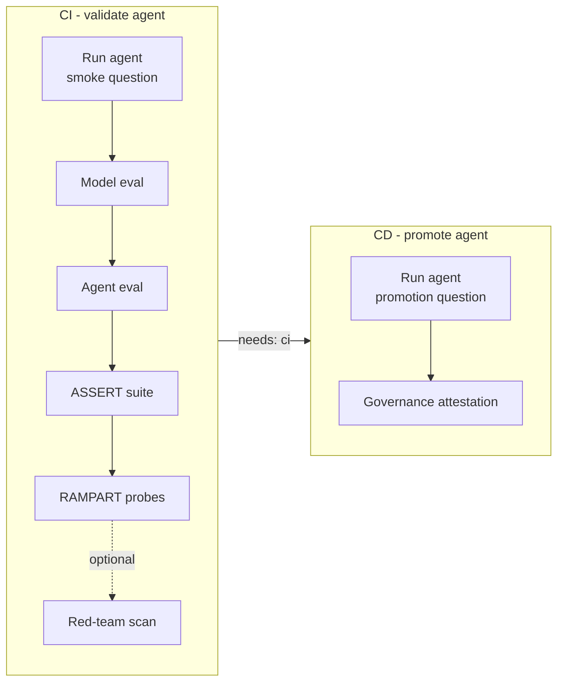

# Agentic AIOps CI/CD Pipeline

The repository ships a single, **manually-triggered** GitHub Actions workflow,
[`.github/workflows/agentic-cicd.yml`](../.github/workflows/agentic-cicd.yml),
that operationalises the agentic AI lifecycle from [`skills.md`](skills.md)
against the hosted Foundry agent (`rfpagent`).

It is a thin wrapper around the same `common/` orchestrators the Streamlit app
uses — the headless entry point is
[`scripts/aiops_pipeline.py`](../scripts/aiops_pipeline.py).

## What it runs



- **CI job** — runs the agent with the question
  *"Summarize RFP for Virgnia Railway express project"*, then **model
  evaluation** and **agent evaluation** over the same datasets used by the
  Evaluations tab, then the **ASSERT** behavioural suite, then the **RAMPART**
  behavioural safety probes (jailbreak, prompt-injection, benign regression).
  The Azure AI Evaluation **red-team** scan is **optional and off by default** —
  enable it by setting the `run_redteam` input to `true` on manual dispatch.
  The ASSERT, RAMPART and (optional) red-team steps are `continue-on-error` so an
  adversarial/non-deterministic result never blocks promotion.
- **CD job** (`needs: ci`) — re-runs the agent with the same question, then runs
  the **agent-governance toolkit** attestation.

Evaluation and (when enabled) red-team results upload to the Foundry project
automatically.
Every step also enables the **Foundry project's agent tracing** (Microsoft
Agent Framework OpenTelemetry instrumentation; `--require-tracing` makes a
failure to enable it fail the step), so both CI and CD agent runs are traced
and logged in Foundry for auditing — no separate Azure Monitor resource
required.

## Trigger it

Actions → **Agentic AIOps CI/CD** → **Run workflow**. You can override the
`question` input; it defaults to the RFP summarization prompt. Tick the
`run_redteam` input to additionally run the Azure AI Evaluation red-team scan
(RAMPART safety probes always run).

## Authentication

The pipeline authenticates with a **service principal** stored in the
`AZURE_CREDENTIALS` secret (standard `azure/login` JSON). A setup step exports
`AZURE_CLIENT_ID` / `AZURE_TENANT_ID` / `AZURE_CLIENT_SECRET` to the job
environment so the app's existing `DefaultAzureCredential` resolves them via
`EnvironmentCredential` — no application code changes, no secrets in code.

## Required configuration

Create the following **repository secrets**:

| Secret | Purpose |
| --- | --- |
| `AZURE_CREDENTIALS` | Service-principal JSON (`clientId`, `clientSecret`, `tenantId`, `subscriptionId`). |
| `AZURE_AI_PROJECT_ENDPOINT` | Foundry project endpoint (required). |
| `AZURE_AI_MODEL_DEPLOYMENT` | Chat model deployment (optional; defaults to `gpt-5.4-mini`). |
| `AZURE_EVAL_JUDGE_MODEL` | Judge model for ASSERT / quality metrics (optional). |
| `AZURE_OPENAI_ENDPOINT` | AOAI endpoint (optional; derived when omitted). |
| `AZURE_SUBSCRIPTION_ID`, `AZURE_RESOURCE_GROUP_NAME`, `AZURE_AI_PROJECT_NAME` | Needed for Risk & Safety evaluators and red-team upload. |
| `ASSERT_TARGET_AGENT` | Target agent name (optional; defaults to `rfpagent`). |
| `GOVERNANCE_SPONSOR_EMAIL` | Sponsor email used in the governance attestation (optional). |

The service principal needs the same data-plane roles the app needs locally
(e.g. **Azure AI User / Developer** on the project) plus access to the
connected Application Insights for trace export.

## Run it locally

The same runner works from a workstation (using your `DefaultAzureCredential`):

```bash
python scripts/aiops_pipeline.py run-agent --question "Summarize RFP for Virgnia Railway express project"
python scripts/aiops_pipeline.py model-eval
python scripts/aiops_pipeline.py agent-eval
python scripts/aiops_pipeline.py assert
python scripts/aiops_pipeline.py redteam
python scripts/aiops_pipeline.py rampart
python scripts/aiops_pipeline.py governance
```

> The `rampart` command needs the RAMPART package, installed separately with
> `pip install --no-deps -r requirements-rampart.txt` (it pins a conflicting
> PyRIT version — see that file for details).

Each command writes a JSON summary to `pipeline-artifacts/` (git-ignored) and
exits non-zero on genuine failure. Add `--no-tracing` to skip telemetry setup.
