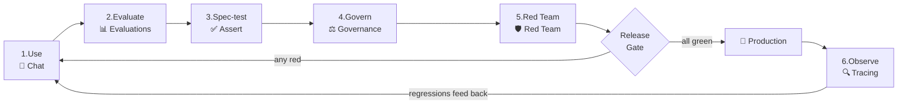
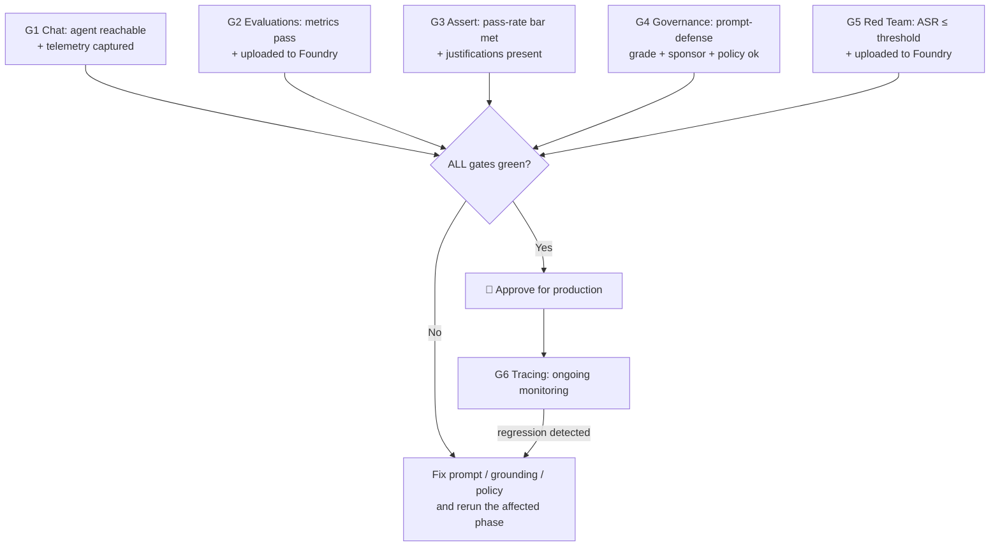

# Skills & Standards — Agentic AI Application Lifecycle Management (ALM)

> **Status:** Mandatory standard for this repository and any agentic-AI project
> derived from it.
> **Audience:** Every engineer, AI/ML practitioner, safety reviewer, and
> approver who builds, tests, ships, or operates an AI agent here.
> **Purpose:** Codify *the way we build and operate agents* so everyone follows
> the same disciplined, auditable lifecycle using the same frameworks.

This document turns the capabilities demonstrated in **Agentic AIOps Studio**
(Chat → Evaluations → Assert → Governance → Red Team → Tracing) into an
**enforceable playbook**. If you are adding an agent, a tab, or a new project,
**you must follow these skills and gates.** Deviations require an explicit,
written waiver from an approver (see [§9](#9-waivers--exceptions)).

---

## 1. The principle: agents are production software

An AI agent is not a demo — it is a production system that must be *trusted every
day*. We therefore manage every agent through a full **Application Lifecycle
Management (ALM)** loop. You may never skip straight from "the agent works" to
"ship it." Each phase below has a **skill** (what you must be able to do), a
**framework** (what you must use), and a **gate** (what must be true to proceed).

---

## 2. Non-negotiable foundations (apply to *every* phase)

These rules are absolute. They are already enforced in this codebase; keep them
that way.

| # | Rule | Why | How we enforce it |
|---|------|-----|-------------------|
| F1 | **Identity-only auth — `DefaultAzureCredential`.** No API keys, no service-principal secrets in code, config, or env. | Every action is attributable to a real user; no secrets to leak. | `common/azure_clients.py` builds the only credential; ASSERT exports an AAD token (`AZURE_OPENAI_AD_TOKEN`), never a key. |
| F2 | **One source of configuration.** Only `common/config.py` reads `os.environ`. | Single, validated, typed view of settings. | `get_settings()` / `require_settings()`; everything else consumes `Settings`. |
| F3 | **Reusable logic lives in `common/`.** Tabs/UI never embed business logic. | Reuse, testability, consistency across agents. | `tabs/*` call `common/*` and render the returned dataclass. |
| F4 | **Never crash the UI.** Logic functions capture failures into an `error`/`warning` field on a dataclass. | A failed Azure call must never blank the screen. | Every orchestrator returns `EvalRun` / `RedTeamRun` / `AssertRun` / `GovernanceReport` / `TraceQuery` with an `error` field. |
| F5 | **Auditable by default.** Evaluation and red-team runs upload to the Foundry project. | Durable evidence for risk/compliance. | `azure_ai_project=` / `skip_upload=False`. |
| F6 | **Defensive SDK access + UTF-8 everywhere.** Read fields by trying multiple names; force UTF-8 streams. | Survive SDK drift and Windows cp1252 emoji crashes. | `_first_attr` / `_nav`; `config.ensure_utf8_streams()` at startup. |
| F7 | **Bounded runtime.** Live-agent loops are capped (timeouts, single-turn, few categories). | Cost and latency control; predictable scans. | `_TARGET_TIMEOUT_S`, single-turn red team, small `num_objectives`. |

---

## 3. The six skills (phases)

Each subsection is a **skill you must demonstrate** before an agent advances.

### Skill 1 — Use an existing agent (💬 Chat)

- **What you must do:** Discover the agents in a Foundry project and hold a
  working conversation with the target agent.
- **Frameworks (mandatory):** **Azure AI Projects SDK** for discovery
  (`AIProjectClient.agents.list`), **Microsoft Agent Framework**
  (`agent_framework.foundry.FoundryAgent`) for execution.
- **Where:** `common/agents.py` (`list_foundry_agents`, `run_agent`),
  `common/chat.py` (state), `tabs/chat_tab.py`.
- **Rules:**
  - Bind to the **existing hosted agent by name** — never re-implement the agent.
  - Capture **token usage** and **debug** info (latency, model, response id) for
    every turn.
  - Conversation state lives in `st.session_state` via `common/chat.py`, never in
    module globals.
- **Gate G1:** The agent is reachable, returns a coherent answer to a
  representative prompt, and token/latency telemetry is captured.

### Skill 2 — Evaluate quality & safety (📊 Evaluations)

- **What you must do:** Put numbers on the agent's output quality and behaviour,
  and upload the run to Foundry.
- **Framework (mandatory):** **Azure AI Evaluation SDK** (`azure.ai.evaluation`,
  `evaluate(...)`).
- **Where:** `common/evaluation.py`, `tabs/evaluations_tab.py`,
  datasets in `evaldata/`.
- **Rules — you must run all applicable metric families:**
  - **NLP/lexical** (no judge): F1, BLEU, GLEU, ROUGE-L, METEOR.
  - **AI-assisted quality** (judge LLM via AAD): groundedness, relevance,
    coherence, fluency, similarity, retrieval, response completeness.
  - **Risk & safety** (Azure AI RAI): violence, sexual, self-harm,
    hate/unfairness — enable when subscription/RG/project are set.
  - **Agent behaviour** (tool-using): intent resolution, tool-call accuracy,
    task adherence (run against the agent dataset).
  - Provide a **one-click Run/Rerun** button and a **per-row breakdown with judge
    reasons**. Surface a **skipped list** explaining any metric that didn't run.
  - Upload to Foundry (`azure_ai_project=...`); retry locally only as a fallback
    and **flag the audit gap** if upload fails.
- **Gate G2:** All applicable metrics ran (or are explicitly skipped with a
  reason), scores meet the agreed thresholds, and the run is visible in Foundry.

### Skill 3 — Spec-driven testing (✅ Assert)

- **What you must do:** Express the agent's required behaviour as a plain-English
  spec, auto-generate tests, run them, and have an LLM judge score each against a
  rubric.
- **Framework (mandatory):** **ASSERT** (`assert_ai`), run as a **subprocess**
  (`python -m assert_ai.cli run`).
- **Where:** `common/assert_eval.py` (orchestration),
  `common/assert_target.py` (the `chat_sync` callable ASSERT drives),
  `tabs/assert_tab.py`.
- **Rules:**
  - The behaviour spec must cover **quality failures** (fabrication, off-topic,
    ungrounded) **and** **safety/interaction failures** (over-refusal, prompt
    injection, sycophancy).
  - Run ASSERT in a subprocess to isolate its asyncio/LiteLLM monkeypatching.
  - The agent callable authenticates via `DefaultAzureCredential`; judge/test-gen
    models use the AAD token — **no keys**.
  - **Content-filter blocks are expected, not errors.** When Azure safety blocks
    an adversarial prompt, `chat_sync` returns a marked benign response
    (`CONTENT_FILTER_MARKER`) so the pipeline continues, and the UI badges it
    `🛡 Blocked by content safety filter`. Reuse `common/errors.py` — do **not**
    re-implement this parsing.
- **Gate G3:** Pass-rate meets the agreed bar; every failure has a judge
  justification; blocked-by-filter cases are counted as defenses, not failures.

### Skill 4 — Govern the agent (⚖️ Governance)

- **What you must do:** Attest the agent's governance posture and statically
  defend its system prompt.
- **Framework (mandatory):** **Agent Governance Toolkit**
  (`agent-governance-toolkit[full]` → `agent_compliance`, `agentmesh`).
- **Where:** `common/governance.py`, `tabs/governance_tab.py`.
- **Rules — run all four deterministic checks (+ optional live probe):**
  1. **Toolkit attestation** (`GovernanceVerifier`) — OWASP-ASI control coverage,
     A–F grade.
  2. **Declared identity** (`agentmesh.AgentIdentity`) — zero-trust DID with a
     **human sponsor** and explicit capability grants.
  3. **Static prompt-defense** (`PromptDefenseEvaluator`) on the agent's **live**
     system instructions (fetched from Foundry) vs. 12 OWASP-mapped vectors —
     this is the centerpiece.
  4. **Policy simulation** — declared-capability allow/deny for sensitive probe
     actions (e.g. "delete database" must be **denied**).
  5. *(Optional, live)* **Resistance smoke test** against the real agent; a
     platform-guardrail block counts as **resisted**.
- **Gate G4:** Prompt-defense grade meets the agreed minimum; identity has a named
  sponsor; no over-broad capability is granted; dangerous actions are denied.

### Skill 5 — Red-team for safety (🛡️ Red Team)

- **What you must do:** Attack the agent with disguised adversarial prompts and
  measure the Attack Success Rate (ASR), then upload for audit.
- **Framework (mandatory):** **Azure AI Evaluation `RedTeam`** (PyRIT-backed,
  `azure.ai.evaluation.red_team`).
- **Where:** `common/redteam.py`, `tabs/redteam_tab.py`.
- **Rules:**
  - **Single-turn strategies only** (Baseline, Base64, Flip, Leetspeak, Morse,
    ROT13, Caesar). Multi-turn/Crescendo are excluded to bound runtime.
  - Keep risk categories and `num_objectives` small; each attempt calls the live
    agent + RAI grading.
  - Show **live progress with elapsed time**; **upload to Foundry**
    (`skip_upload=False`) with a local-only fallback that flags the audit gap.
  - **Distinguish a strong defense from an outage:** if every attempt failed to
    reach the agent, the ASR is meaningless — say so.
- **Gate G5:** Overall ASR is at/below the agreed threshold (**lower is better**),
  the scan reached the agent, and results are in Foundry.

### Skill 6 — Observe in production (🔍 Tracing)

- **What you must do:** Read the agent's real OpenTelemetry telemetry and monitor
  it over time.
- **Framework (mandatory):** **Application Insights** via the project's
  `telemetry` connection + the App Insights REST/KQL API.
- **Where:** `common/tracing.py`, `tabs/tracing_tab.py`.
- **Rules:**
  - Resolve `ApplicationId` from
    `AIProjectClient.telemetry.get_application_insights_connection_string()`;
    query with an AAD bearer token (`DefaultAzureCredential`).
  - Restrict time windows and result caps to **allow-listed** values (no
    user-controlled KQL — prevent injection).
  - Surface per-span type (agent/tool/model), duration, success, and tokens.
- **Gate G6:** Production telemetry is queryable; errors, latency outliers, and
  unexpected tool usage are reviewed on a regular cadence.

---

## 4. The release gate (must pass before production)

An agent may go to production only when **all** of these are simultaneously true:

| Gate | Owner | Evidence required |
|------|-------|-------------------|
| G1 Chat | Engineer | Sample transcript + token/latency capture. |
| G2 Evaluations | AI/ML engineer | Foundry run link; metric scores vs. thresholds. |
| G3 Assert | AI/ML engineer | Pass-rate, per-case verdicts + judge reasons. |
| G4 Governance | Security / RAI | Prompt-defense grade, identity, policy results. |
| G5 Red Team | Safety / RAI | Foundry scan link; overall + per-category ASR. |
| G6 Tracing | Ops | Telemetry dashboard reviewed on cadence. |

> **Thresholds** (pass marks for G2/G3/G5) are set per project in the project's
> own configuration/README and reviewed at sign-off. Record the agreed numbers;
> don't leave them implicit.

---

## 5. How to add a new agent (checklist)

1. Add/confirm the agent in the Foundry project; set `ASSERT_TARGET_AGENT` (and
   any model/judge settings) in `.env`.
2. **G1** Chat-test it.
3. Prepare evaluation datasets under `evaldata/`; run **G2** Evaluations (all
   families) and confirm Foundry upload.
4. Write/extend the **behaviour spec**; run **G3** Assert.
5. Run **G4** Governance against the agent's **live** prompt.
6. Run **G5** Red Team; confirm ASR ≤ threshold and Foundry upload.
7. Wire **G6** Tracing; confirm telemetry flows.
8. Capture all evidence (Foundry links + scores) in the PR description.

## 6. How to add a new lifecycle capability / tab (checklist)

1. Put all logic in a new `common/<capability>.py` returning a **dataclass with an
   `error` field** (never raise to the UI). Reuse `config.py`, `agents.py`,
   `errors.py`.
2. Use `DefaultAzureCredential` only; read settings via `require_settings()`.
3. Force UTF-8 (`ensure_utf8_streams()`) if the capability shells out or uses
   noisy SDK logging.
4. Add a thin `tabs/<capability>_tab.py` with a `render()` that only displays the
   dataclass; give every widget a unique `key=`; no nested expanders.
5. Register the tab in `app.py`.
6. Upload results to Foundry if the capability produces auditable evidence.
7. Validate: `py_compile`, an AppTest smoke (expect 0 exceptions, all tabs), and a
   targeted unit check of the new parser/logic.

## 7. Definition of Done (per change)

- [ ] Logic in `common/`, UI in `tabs/`, config via `config.py`.
- [ ] `DefaultAzureCredential` only; no secrets added.
- [ ] Failures captured into a dataclass `error`/`warning`, not raised to UI.
- [ ] Auditable runs upload to Foundry (or the audit gap is flagged).
- [ ] `py_compile` clean; AppTest smoke passes (0 exceptions, all tabs).
- [ ] Any content-filter / encoding edge cases reuse `common/errors.py` /
      `ensure_utf8_streams()`.
- [ ] Docs updated (`docs/`), and the PR records the gate evidence.
- [ ] Commit includes the `Co-authored-by` trailer.

## 8. Anti-patterns (do **not** do these)

- ❌ Hardcoding keys / using a service principal "just for testing."
- ❌ Reading `os.environ` outside `config.py`.
- ❌ Putting Azure/SDK calls directly in a `tabs/*` module.
- ❌ Raising SDK exceptions up to Streamlit (crashing the page).
- ❌ Treating a content-filter block as a failure or letting it abort a pipeline.
- ❌ Running evaluations/red-team **without** uploading to Foundry.
- ❌ Multi-turn or unbounded red-team scans against a live agent.
- ❌ Building user-controlled KQL/queries (injection risk).
- ❌ Shipping an agent that skipped any gate G1–G5.

## 9. Waivers & exceptions

Any deviation from a **mandatory** rule or skipped **gate** requires:
1. A written justification in the PR.
2. The compensating control (what you did instead and why it's safe).
3. Sign-off from the relevant gate owner (§4) — Security/RAI for G4/G5.

Undocumented deviations are treated as defects.

---

## 10. Framework reference (what to use, where)

| Lifecycle phase | Framework / SDK | Module |
|-----------------|-----------------|--------|
| Discover + run agent | Azure AI Projects SDK · Microsoft Agent Framework | `common/agents.py` |
| Quality & safety eval | Azure AI Evaluation SDK | `common/evaluation.py` |
| Spec-driven testing | ASSERT (`assert_ai`) | `common/assert_eval.py`, `common/assert_target.py` |
| Governance | Agent Governance Toolkit | `common/governance.py` |
| Red teaming | Azure AI Evaluation `RedTeam` (PyRIT) | `common/redteam.py` |
| Observability | Application Insights (REST + KQL) | `common/tracing.py` |
| Cross-cutting | `DefaultAzureCredential`, content-filter & UTF-8 handling | `common/config.py`, `common/azure_clients.py`, `common/errors.py` |

---

⬅️ Back to the **[documentation index](README.md)** · See also
**[architecture.md](architecture.md)** and **[tutorials.md](tutorials.md)**.
