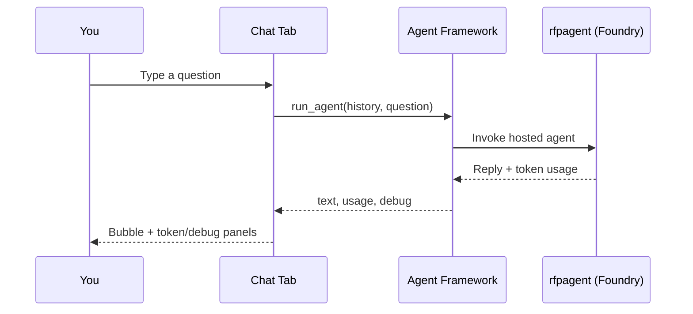
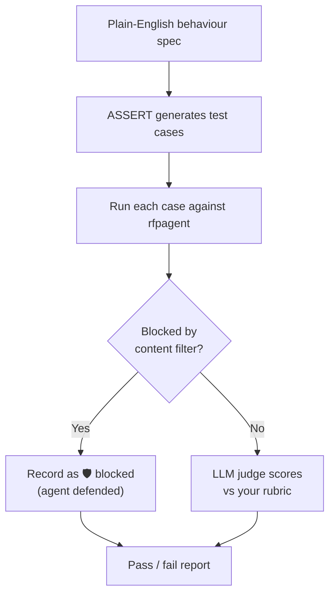
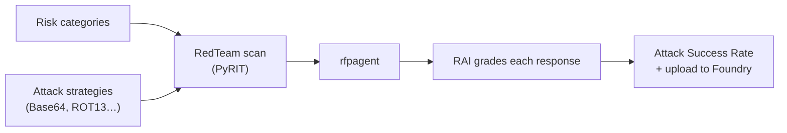
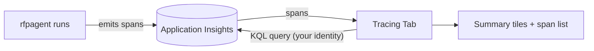
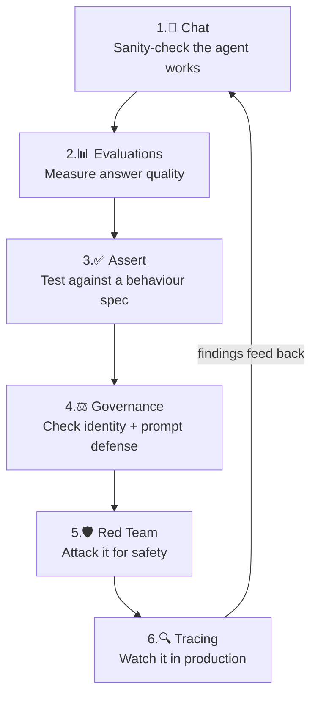

# Tutorials — A Guided Tour of Every Tab

This is a hands-on walkthrough. Have the app running (see
[getting-started.md](getting-started.md)) and follow along. Each section
explains **what the tab is for**, **what you'll see**, **how to use it**, and
**how to read the results** — in plain English.

Throughout, the example agent is **`rfpagent`**: a hosted Microsoft Foundry agent
that drafts answers to RFP (Request for Proposal) / procurement questions, grounded
in proposal materials.

> 🧠 **Mental model:** Chat is for *using* the agent. The other five tabs are for
> *trusting* the agent — proving it is accurate, safe, well-governed, hard to
> trick, and observable.

---

## 💬 Tab 1 — Chat

**What it's for:** Have a live conversation with any agent in your Foundry
project. This is the everyday "talk to the agent" experience.

**What you'll see:**

- A **top row** with: an agent dropdown, a **🔄 Refresh** button (reloads the
  agent list), a **🗑️ Clear** button (wipes the conversation), and a **status
  chip** showing how many agents are connected.
- A **left container** (fixed height, scrollable) holding the conversation
  history as chat bubbles.
- A **right container** with three expandable panels for the *latest* turn:
  - **Agent Output** — the raw response text.
  - **Token Usage** — input / output / total tokens consumed.
  - **Debug Information** — agent id, version, model, latency, response id.
- A **chat input box** pinned to the bottom.

**How to use it:**

1. Pick an agent from the dropdown.
2. Type a question (e.g. *"What are the best practices from the Virginia Railway
   Express project?"*) and press Enter.
3. Read the reply on the left; expand the right-hand panels to inspect tokens and
   debug details.

**How to read it:** If the status chip is green you're connected. If a turn fails,
the assistant bubble starts with ⚠️ and the error is shown — the app never
crashes on an agent error.

---

## 📊 Tab 2 — Evaluations

**What it's for:** Put a *number* on how good the agent's answers are. It scores a
dataset of agent responses against many metrics, and uploads the run to your
Foundry project so it's auditable.

There are **two independent expanders**, each with its own **Run / Rerun** button:

### A. Model / response evaluation (dataset: `evaldata/datarfp.jsonl`)

Scores the *text* of answers across three families of metrics:

| Family | Metrics | Needs a judge model? |
|--------|---------|----------------------|
| **NLP / Lexical** | F1, BLEU, GLEU, ROUGE-L, METEOR | No — pure text overlap with the "right answer". |
| **AI-assisted Quality** | groundedness, relevance, coherence, fluency, similarity, retrieval, response completeness | Yes — an LLM acts as a "judge". |
| **Risk & Safety** | violence, sexual, self-harm, hate/unfairness | Uses the Azure AI safety service (needs subscription/RG/project set). |

### B. Agent evaluation (dataset: `evaldata/datarfpagent.jsonl`)

Scores *agent behaviour* (tool use), not just text:

| Metric | Plain-English meaning |
|--------|----------------------|
| **intent_resolution** | Did the agent understand and address what the user actually wanted? |
| **tool_call_accuracy** | Did it call the right tools with the right inputs? |
| **task_adherence** | Did it follow the assigned task and instructions? |

**How to use it:** Click **Run** in either expander. A spinner shows while it
works. When done, you get:

- **Aggregate metric cards** (one score per metric).
- A **per-row breakdown** — each test row, the agent's response, the score, and
  the judge's *reason*.
- A **"View in Foundry"** link to the stored run.
- A **skipped list** explaining any metric that couldn't run (e.g. safety
  metrics when subscription details are missing).

**How to read it:** Higher is better for quality metrics; for safety metrics,
lower risk is better. The judge's written reasons tell you *why* a row scored the
way it did.

> 🔎 **Why upload to Foundry?** So every evaluation is stored centrally — you get
> an audit trail and can compare runs over time, rather than scores that vanish
> when you close the browser.

---

## ✅ Tab 3 — Assert

**What it's for:** **Spec-driven testing.** You describe — in plain English — how
the agent *should* behave, and the **ASSERT** framework automatically generates
test cases, runs them against the agent, and has an LLM judge grade each response
against your rubric.

**What you'll see:** Controls to tune the run (how many test categories, how many
prompts, concurrency) and a **Run** button. Results show:

- A **pass-rate** summary and per-dimension failure rates.
- A list of **test cases**, each with a ✅/❌ verdict, the prompt, the agent's
  response, and the judge's justification.
- 🛡️ **"Content filtered"** badges on any case where Azure's safety system
  blocked an adversarial prompt — see the callout below.

**The default behaviour spec** checks for things like fabricating facts, answering
off-topic, over-refusing legitimate requests, and following malicious instructions
hidden in pasted text (prompt injection).

> 🛡️ **Content-filter handling (important):** ASSERT sometimes generates
> adversarial or jailbreak-style prompts on purpose. When such a prompt hits the
> agent, Azure OpenAI's content-management policy may *block it* with an HTTP 400
> error. That's the safety system **working** — the agent successfully refused.
> Rather than crash the run, the app catches this, marks the case with an orange
> **"🛡 Blocked by content safety filter"** badge, and keeps going. This logic
> lives in the reusable `common/errors.py` module.

---

## ⚖️ Tab 4 — Governance

**What it's for:** Check the agent's **governance and security posture** using the
Microsoft **Agent Governance Toolkit**. Think of it as a compliance and
trust-fabric checkup.

It runs up to five checks (the first four are fast and deterministic; the fifth is
an optional live test):

| # | Check | Plain-English meaning |
|---|-------|----------------------|
| 1 | **Toolkit attestation** | The toolkit's overall control coverage and an A–F grade (OWASP-ASI controls). |
| 2 | **Declared identity** | Mints a zero-trust digital identity (DID) for the agent, with a human sponsor and a list of allowed capabilities. |
| 3 | **Static prompt-defense** | Reads the agent's *actual* system prompt (live from Foundry) and scores it against 12 known attack patterns. **This is the centerpiece.** |
| 4 | **Policy simulation** | Checks which sensitive actions the declared capabilities allow vs. deny (e.g. "delete database" should be denied). |
| 5 | **Live resistance smoke test** *(optional)* | Actually sends a few adversarial prompts to the agent and grades whether it resisted. |

**How to read it:** Each check shows a grade or pass/deny breakdown. A blocked
adversarial prompt counts as the agent **resisting** (a good outcome), not an
error.

---

## 🛡️ Tab 5 — Red Team

**What it's for:** Automated **adversarial safety testing**. It uses Azure AI
Evaluation's `RedTeam` capability (built on Microsoft's PyRIT) to attack the agent
with disguised harmful prompts and measure how often the attacks succeed.

**Deliberately kept small** so a scan finishes quickly:

- **Single-turn attacks only** (no multi-turn "crescendo" attacks).
- A few **risk categories** (e.g. Hate & Unfairness, Violence).
- A few **attack strategies** that disguise the prompt — Baseline, Base64, Flip,
  Leetspeak, Morse, ROT13, Caesar.

**How to use it:** Pick categories and strategies, then click **Start**. A live
progress display shows elapsed time. When done you get:

- An **overall Attack Success Rate (ASR)** — *lower is better*.
- ASR broken down **by category** and **by technique**.
- A table of every attack attempt, the disguised prompt, and the agent's response.
- The run is **uploaded to Foundry** for auditing.

**How to read it:** A low ASR means the agent resisted most attacks. The app is
careful to distinguish a *strong defense* (attacks blocked) from an *outage* (the
agent couldn't be reached) — if every attempt failed to reach the agent, it tells
you the ASR is not meaningful.

---

## 🔍 Tab 6 — Tracing

**What it's for:** Look at the agent's **live telemetry** — the actual logs of
what happened when the agent ran in production.

**How it works:** Foundry agents emit OpenTelemetry "spans" to the **Application
Insights** resource connected to your project. This tab reads those spans back.

**How to use it:**

1. Pick one or more **agents** (only those with recent telemetry appear).
2. Choose a **time window** (Last hour / 24 hours / 7 days / 30 days).
3. Choose a **result cap** (top 50 / 100 / 200 / 500 spans).
4. Load the traces.

**What you'll see:** Summary tiles (total spans, agent invocations, tool calls,
model calls, errors, tokens, average duration) and a detailed list of spans —
each with a timestamp, type (agent / tool / model chat), duration, success flag,
and token counts.

**How to read it:** Use it to answer *"What has this agent actually been doing this
week?"* — spotting errors, slow calls, or unexpected tool usage.

---

## Putting it together: a typical workflow

A team might **chat** to confirm the agent is alive, **evaluate** to baseline
quality, run **Assert** + **Red Team** before each release to catch regressions
and safety issues, use **Governance** for a compliance sign-off, and keep an eye on
**Tracing** once it's live.

---

➡️ **Next:** open **[architecture.md](architecture.md)** to see how it's built, or
**[business-value.md](business-value.md)** for the "why it matters" story.
